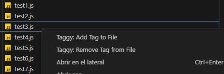
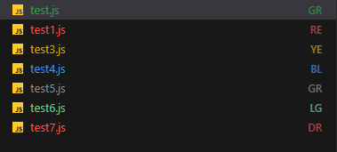

# Taggy - File Tagging Extension for VS Code 👏

Taggy is a Visual Studio Code extension that allows you to assign custom tags with two letters and colors to your files. Easily keep your workspace organized by marking files with meaningful labels and visual cues.

## Features 📖

- Add custom tags to files with two letters.
- Assign colors to tags for quick identification.
- View tags directly in the file explorer.
- Fully integrated with VS Code decorations.

## How to Use ❔

1. **Install the Extension**: Clone the repository and load it as a VS Code extension.
2. **Add a Tag**:
   - Right-click on a file in the file explorer.
   - Select `Taggy: Add Tag to File`.
   - Enter the tag name and a color (use theme color names, e.g., Green 🍀, Red 💗, Yellow 🍌).
3. **View Tags**: Tags appear as badges in the file explorer with the assigned colours and first two letters from tag.
4. **Remove Tag**:
   - Right-click on a file in the file explorer.
   - Select `Taggy: Remove Tag from File`

##

  

  

